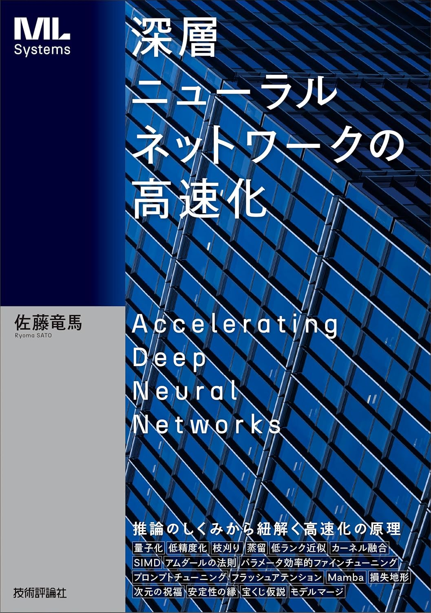

<p align="center">
  
</p>

書籍『[深層ニューラルネットワークの高速化](https://www.amazon.co.jp/dp/4297143097)』のサポートページです。

# ノートブック

以下のノートブックは MIT ライセンスのもと配布されております。商用・非商用問わず自由に利用することができます。

### 環境構築

[Poetry](https://python-poetry.org/) をインストールした後、このディレクトリ上で

```
$ poetry install
$ poetry run jupyter lab
```

を実行して Jupyter Lab を起動してください。

### 一覧

|箇所|説明|ファイル|Colab|
|:----|:----|:----|:----:|
|コード 2.1|GPU でのコンパイル|[compile.ipynb](https://github.com/joisino/speedbook/blob/main/notebooks/compile.ipynb)|[](https://colab.research.google.com/github/joisino/speedbook/blob/main/notebooks/compile.ipynb)|
|コード 2.2|CPU でのコンパイル|[compile_cpu.ipynb](https://github.com/joisino/speedbook/blob/main/notebooks/compile_cpu.ipynb)|[](https://colab.research.google.com/github/joisino/speedbook/blob/main/notebooks/compile_cpu.ipynb)|
|コード 2.3|メモリ配列の最適化 (channel last)|[channel_last.ipynb](https://github.com/joisino/speedbook/blob/main/notebooks/channel_last.ipynb)|[](https://colab.research.google.com/github/joisino/speedbook/blob/main/notebooks/channel_last.ipynb)|
|コード 3.2|FP16 の利用|[fp16.ipynb](https://github.com/joisino/speedbook/blob/main/notebooks/fp16.ipynb)|[](https://colab.research.google.com/github/joisino/speedbook/blob/main/notebooks/fp16.ipynb)|
|コード 3.4|CPU での BF16 の利用|[bf16_cpu.ipynb](https://github.com/joisino/speedbook/blob/main/notebooks/bf16_cpu.ipynb)|[](https://colab.research.google.com/github/joisino/speedbook/blob/main/notebooks/bf16_cpu.ipynb)|
||GPU での BF16 の利用|[bf16.ipynb](https://github.com/joisino/speedbook/blob/main/notebooks/bf16.ipynb)|[](https://colab.research.google.com/github/joisino/speedbook/blob/main/notebooks/bf16.ipynb)|
|コード 3.8|自動混合精度計算|[amp.ipynb](https://github.com/joisino/speedbook/blob/main/notebooks/amp.ipynb)|[](https://colab.research.google.com/github/joisino/speedbook/blob/main/notebooks/amp.ipynb)|
|コード 3.9|行列の量子化|[quantize_matrix.ipynb](https://github.com/joisino/speedbook/blob/main/notebooks/quantize_matrix.ipynb)|[](https://colab.research.google.com/github/joisino/speedbook/blob/main/notebooks/quantize_matrix.ipynb)|
|コード 3.10|INT8 量子化|[quantization.ipynb](https://github.com/joisino/speedbook/blob/main/notebooks/quantization.ipynb)|[](https://colab.research.google.com/github/joisino/speedbook/blob/main/notebooks/quantization.ipynb)|
|コード 4.2|枝刈り|[pruning.ipynb](https://github.com/joisino/speedbook/blob/main/notebooks/pruning.ipynb)|[](https://colab.research.google.com/github/joisino/speedbook/blob/main/notebooks/pruning.ipynb)|
|コード 4.3|枝刈りの速度計測|[pruning_benchmark.ipynb](https://github.com/joisino/speedbook/blob/main/notebooks/pruning_benchmark.ipynb)|[](https://colab.research.google.com/github/joisino/speedbook/blob/main/notebooks/pruning_benchmark.ipynb)|
|コード 5.1|ResNext121 から ResNet18 への蒸留|[distillation.ipynb](https://github.com/joisino/speedbook/blob/main/notebooks/distillation.ipynb)|[](https://colab.research.google.com/github/joisino/speedbook/blob/main/notebooks/distillation.ipynb)|
|図 6.3|顔写真データの低ランク性|[lowrankface.ipynb](https://github.com/joisino/speedbook/blob/main/notebooks/lowrankface.ipynb)|[](https://colab.research.google.com/github/joisino/speedbook/blob/main/notebooks/lowrankface.ipynb)|
|コード 6.1|畳み込み層の低ランク近似|[lowrank.ipynb](https://github.com/joisino/speedbook/blob/main/notebooks/lowrank.ipynb)|[](https://colab.research.google.com/github/joisino/speedbook/blob/main/notebooks/lowrank.ipynb)|
|コード 6.2|ランダム特徴量|[random_features.ipynb](https://github.com/joisino/speedbook/blob/main/notebooks/random_features.ipynb)|[](https://colab.research.google.com/github/joisino/speedbook/blob/main/notebooks/random_features.ipynb)|
|コード 6.3|正値直交ランダム特徴量による高速注意 (FAVOR+)|[favor.ipynb](https://github.com/joisino/speedbook/blob/main/notebooks/favor.ipynb)|[](https://colab.research.google.com/github/joisino/speedbook/blob/main/notebooks/favor.ipynb)|
|コード 8.1|プロファイリング|[profile.ipynb](https://github.com/joisino/speedbook/blob/main/notebooks/profile.ipynb)|[](https://colab.research.google.com/github/joisino/speedbook/blob/main/notebooks/profile.ipynb)|

※ノートブック作成にあたり再実行したので書籍の結果とわずかに異なる場合があります。ご了承ください。

# 正誤表

本書の正誤情報は[正誤表](https://github.com/joisino/speedbook/blob/main/errata.md)にて公開しています。
